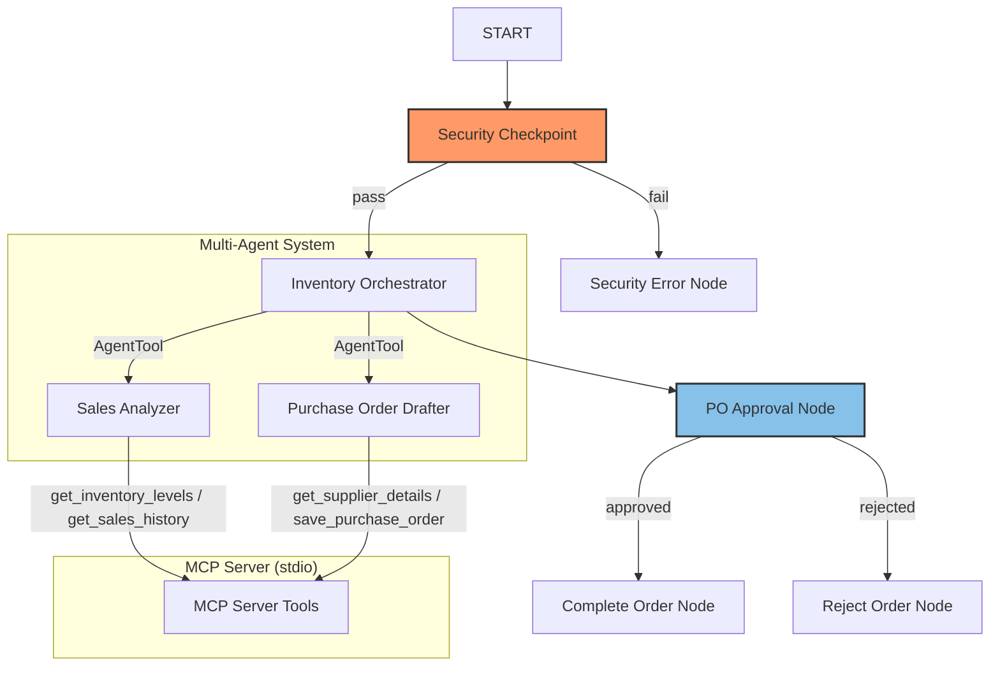

# Project Submission: Inventory Forecast Agent

## Problem Statement
In retail and e-commerce business operations, managing inventory and restocking levels manually is slow, prone to errors, and vulnerable to security risks. Purchasing coordinators must constantly cross-reference current stock sheets with sales metrics, decide what needs restocking, find supplier details, and write formal purchase orders. Furthermore, exposing backend inventory databases to external systems introduces data integrity and security challenges (such as prompt injections or data leaks of sensitive emails and credit cards). 

The `inventory-forecast-agent` addresses this need by providing an automated, secure multi-agent workflow that calculates inventory needs, drafts formal Purchase Orders, enforces strict data security policies, and includes a Human-in-the-loop approval mechanism before any order is finalized.

## Solution Architecture

The solution uses a graph-based workflow that controls the coordination between specialized sub-agents and external data tools:

## Concepts Used
1.  **ADK Workflow Graph API**: Structured in [app/agent.py](file:///Users/siyavijayvhanagade/Desktop/adk%20workspace/inventory-forecast-agent/app/agent.py#L227-L245) using `Workflow`, `Edge`, and `@node` decorators to control flow deterministically.
2.  **LlmAgent Sub-agents**: Two specialized LLM sub-agents defined in [app/agent.py](file:///Users/siyavijayvhanagade/Desktop/adk%20workspace/inventory-forecast-agent/app/agent.py#L63-L84): `sales_analyzer` and `purchase_order_drafter`.
3.  **AgentTool**: Employed in [app/agent.py](file:///Users/siyavijayvhanagade/Desktop/adk%20workspace/inventory-forecast-agent/app/agent.py#L86-L99) by the `inventory_orchestrator` to delegate sub-tasks dynamically while maintaining control.
4.  **MCP Server**: Implemented in [app/mcp_server.py](file:///Users/siyavijayvhanagade/Desktop/adk%20workspace/inventory-forecast-agent/app/mcp_server.py) using the FastMCP SDK, allowing sub-agents to interface with inventory databases, sales metrics, and suppliers over stdio transport.
5.  **Security Checkpoint**: Implemented in [app/agent.py](file:///Users/siyavijayvhanagade/Desktop/adk%20workspace/inventory-forecast-agent/app/agent.py#L116-L159) as a workflow node at the entry point of the graph.
6.  **Agents CLI**: Used to scaffold the project structure, generate base configurations, and manage dependencies.

## Security Design
*   **Prompt Injection Detection**: Scans user inputs for command override keywords (e.g. `ignore previous instructions`, `system prompt`). If detected, it immediately blocks execution, preventing jailbreak attacks.
*   **PII Scrubbing**: Automatically detects and redacts Credit Card numbers and Email patterns to ensure user data privacy.
*   **Domain-Specific Policy**: Explicitly blocks destructive database commands (e.g., `delete inventory`, `clear stock`), protecting the underlying database from malicious queries.
*   **Structured JSON Audit Logs**: Emits structured logging (INFO, WARNING, CRITICAL) for every security decision and state transition, facilitating immediate security auditing.

## MCP Server Design
The MCP server provides standard interfaces for inventory management tools:
*   `get_inventory_levels`: Returns current product stock vs minimum threshold settings.
*   `get_sales_history`: Returns weekly unit sales numbers used to compute velocity.
*   `get_supplier_details`: Returns supplier emails and lead times.
*   `save_purchase_order`: Commits the drafted PO details into the local filesystem `/artifacts` folder.

## HITL Flow
The **Human-in-the-Loop** checkpoint is implemented in [app/agent.py](file:///Users/siyavijayvhanagade/Desktop/adk%20workspace/inventory-forecast-agent/app/agent.py#L160-L193) via the `po_approval_node` using `RequestInput` with the interrupt ID `"po_approval"`. 
*   **Why**:Finalizing purchase orders involves spending company capital and coordinating with suppliers. This step ensures that a human operator verifies the items, quantities, and prices drafted by the agent before committing them to the database.

## Demo Walkthrough
1.  **Standard Replenishment**: The user asks the agent to analyze inventory and draft a PO. The agent uses the MCP toolset, identifies low-stock items, drafts the PO, and pauses for approval. The user approves it, and the order is saved successfully.
2.  **Order Rejection**: The user requests a PO, but rejects the drafted quantity. The workflow transitions to the `reject_order` node, logging the rejection to the audit logs and halting the purchase.
3.  **Blocked Injection**: The user inputs a malicious prompt injection query. The `security_checkpoint` flags the violation, logs a CRITICAL event, and stops execution immediately.

## Impact / Value Statement
The `inventory-forecast-agent` bridges the gap between AI autonomy and business safety. It saves procurement teams hours of work by automating data retrieval and order drafting, while providing peace of mind through strict input validation, data redaction, and mandatory human authorization.
